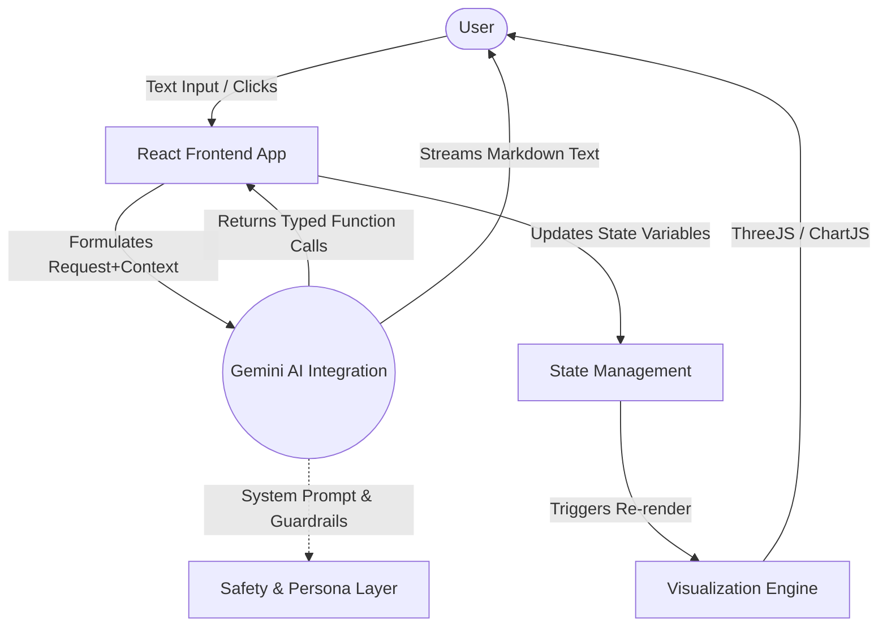

# AI-Powered Antenna Laboratory (Professional Edition)

A professional-grade, research-oriented antenna array simulator and design platform. Achieves **Grade 5 Engineering Excellence** through true physical geometries, mathematical transparency, and AI-driven spatial analysis.

---

## 🚀 Grade 5 Engineering Features

### 📡 True Physical 3D Geometries
Advanced geometric representations for over 25+ antenna variants:
- **Parametric Helical Antennas**: True 3D tube geometries ($x=a\cos(t), y=S\cdot t, z=a\sin(t)$) computed natively in `react-three-fiber` with tunable radii, pitch, and turn counts.
- **Directional Horns**: Specifically truncated pyramidal and conical matrices.
- **Parabolic Dishes**: Real 3D concave hemispherical reflectors.
- **Yagi-Uda Arrays**: Accurate structural models with independent parasitic directors and reflectors.
- **Dipoles & Monopoles**: Precision cylindrical radiators accurately scaled to resonant frequency ($\lambda$).

### 🧬 Advanced Array Design & Lattice Scaling
Design complex array structures used in 5G Base Stations and Satellite Communications:
- **Equilateral Triangular Layouts**: Rigorous geometric positioning of elements exactly along the perimeter of an XZ equilateral plane.
- **3D Cylindrical Stacking**: Multi-layer vertical stacking logic with explicit visual stack spacing (`d_s`) and unique layer color-coding (Blue, Emerald, Amber, etc.).
- **Dynamic 3D Radiation Heatmaps**: The mathematical *Array Factor* correctly bounds theoretical zero-limits, rendering a fully scaled 3D spherical heatmap that accurately encompasses the total array structure.

### 📐 Mathematical Transparency (Formula Engine)
Dynamic LaTeX-rendered math panel using **KaTeX**. Visualize the exact **Array Factor (AF)** calculation logic in real-time.
- Single unified overlay natively attached to the bottom-left displaying $E_{total} = E_{element} \times AF$.
- Dynamic summation indices (reflecting $M$ stacks and $N$ elements) depending on the selected architecture.

### 🏛️ Three-Zone Professional UI
- **70/30 Split Layout**: Clean responsive flexbox reserving 70% of spatial orientation to the 3D theatre / 2D plot, and 30% for configuration panels.
- **Dark/Light Mode**: Full functional integration at the top-right tailored for strict contrast ratios and reading accessibility.
- **Floating AI Consultant**: Collapsible design reviewer with an expert engineering persona stationed at the bottom-right.

## Features
- **AI Agent Orchestration**: Integrated Gemini 2.5 Pro Chatbot acting as an Expert Telecommunications Engineer. It can directly adjust application parameters (frequency, lengths, models, view modes) through Function Calling.
- **3D Visualization**: Real-time rendering of 3D antenna shapes and radiation geometries utilizing `three.js`.
- **2D Radiation Charts**: Deep comparative E-Field polar plots utilizing `chart.js`.
- **Robust Error Handling**: Application states and calculus routines are safeguarded behind Error Boundaries and try-catch structures, ensuring graceful fallbacks.
- **Dynamic Theming & Accessibility**: Light/Dark modes tailored for strict contrast ratios and reading accessibility.

## Architecture



### Architecture Description
1. **User Interaction**: The user queries the Chatbot or directly adjusts UI toggles.
2. **AI Inference & Function Calling**: The React frontend passes the user's message, alongside the current simulation context (e.g., "Current Frequency: 145 MHz"), to the Gemini API.
3. **Guardrails**: The System Prompt explicitly enforces specialized personas and filters out non-telecommunication queries. 
4. **Structured Outputs**: If the model determines a UI change is required, it returns a structured JSON payload targeting predefined hooks (`change_view_mode`, `set_antenna_parameters`, etc.).
5. **State & Physics Execution**: React updates state variables, and complex mathematical routines (`calculateEField`) compute the new physical traits instantly inside error boundaries.
6. **Rendering**: The components stream both the textual AI response and the updated 2D/3D graphical output seamlessly back to the user.

## AI Implementation Details
- **Prompt Engineering**: The System Prompt forces "Chain-of-Thought" (`<thought>` tags) allowing the model to decompose complex telecom queries before answering. The persona is strictly constrained to an "Expert Telecommunications Engineer and Academic Mentor."
- **Safety Measures (Guardrails)**: The System Prompt mandates explicit refusal for irrelevant, harmful, or out-of-context requests (prompt injection defenses).
- **Function Calling**: We utilize structured `tools` passed in the Gemini configuration to tightly bind the LLM to the React component's setter functions.
- **Feedback Loops**: Implemented skeleton loaders, real-time typing indicators, and distinct `<thought>` block visualizations to assure the user the AI is analyzing the request.

## Technology Stack
- **Frontend**: React, TypeScript, Vite
- **AI Integration**: `@google/genai` (Gemini API)
- **Styling**: Tailwind CSS, Lucide React
- **Graphics**: Three.js, Chart.js

## Getting Started

### Prerequisites
- [Node.js](https://nodejs.org/) installed on your machine.
- A valid [Google Gemini API Key](https://aistudio.google.com/app/apikey).

### Installation & Local Setup

1. **Clone the repository:**
   ```bash
   git clone https://github.com/zsasannia70-png/antenna-3d-simulator.git
   cd antenna-3d-simulator
   ```

2. **Install dependencies:**
   ```bash
   npm install
   ```

3. **Configure Environment Variables:**
   Create a `.env` file in the root directory based on `.env.example.txt` and add your API key:
   ```env
   VITE_GEMINI_API_KEY="AIzaSyYourGeneratedApiKeyHere..."
   ```

4. **Start the local development server:**
   ```bash
   npm run dev
   ```

5. **Open in Browser:**
   Navigate to [http://localhost:3000](http://localhost:3000)

### Building for Production
```bash
npm run build
```
Generates a `dist` folder optimized for production deployments (e.g., GitHub Pages, Vercel).
